#  Neiroart
A collection of scripts that generate images. Generative art.

### Installation
Code written on [Python](https://www.python.org). Scripts uses `PIL` and `numpy` libraries to generate images.

```sh
pip3 install -r requirements.txt
```

### Settings
Each script has their own settings. You can show it with `-help` flag. Each script had default settings, which can be viewd and updated in `settings.toml` file.

You can also pass different `:aliases` in parameters. Aliases can be found via additional help commands:

```sh
# Glyphs
--show-glyphsets

# Colors
--show-colors
--show-colorsets

# Zombatar colors
--show-bright-colors
--show-common-colors
--show-skin-colors
```

You can add your own aliases in `aliases.py` file. All image samples for generators can be found in `src/img/` folder. 

### Examples
`zombatars.py`
|  |  |  |
|-|-|-|

`enemies.py`
| 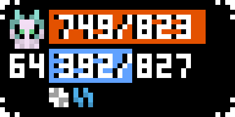 | 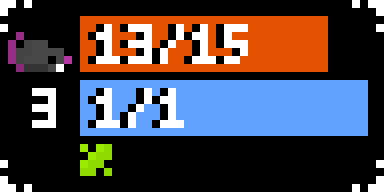 | 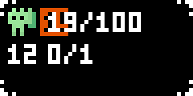 |
|-|-|-|

`glyphs.py`
<table width="100%">
  <tr>
    <td width="33.333%"></td>
    <td width="33.333%"></td>
    <td width="33.333%"></td>
  </tr>
</table>

`mapper.py`
| 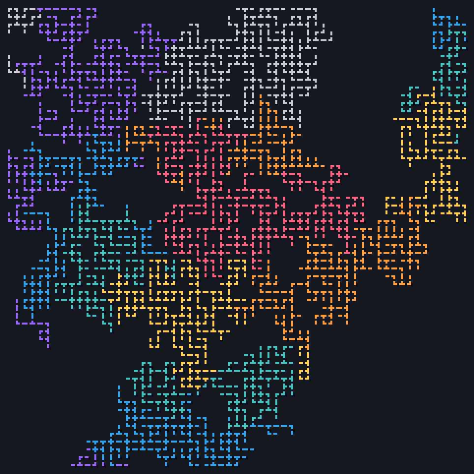 | 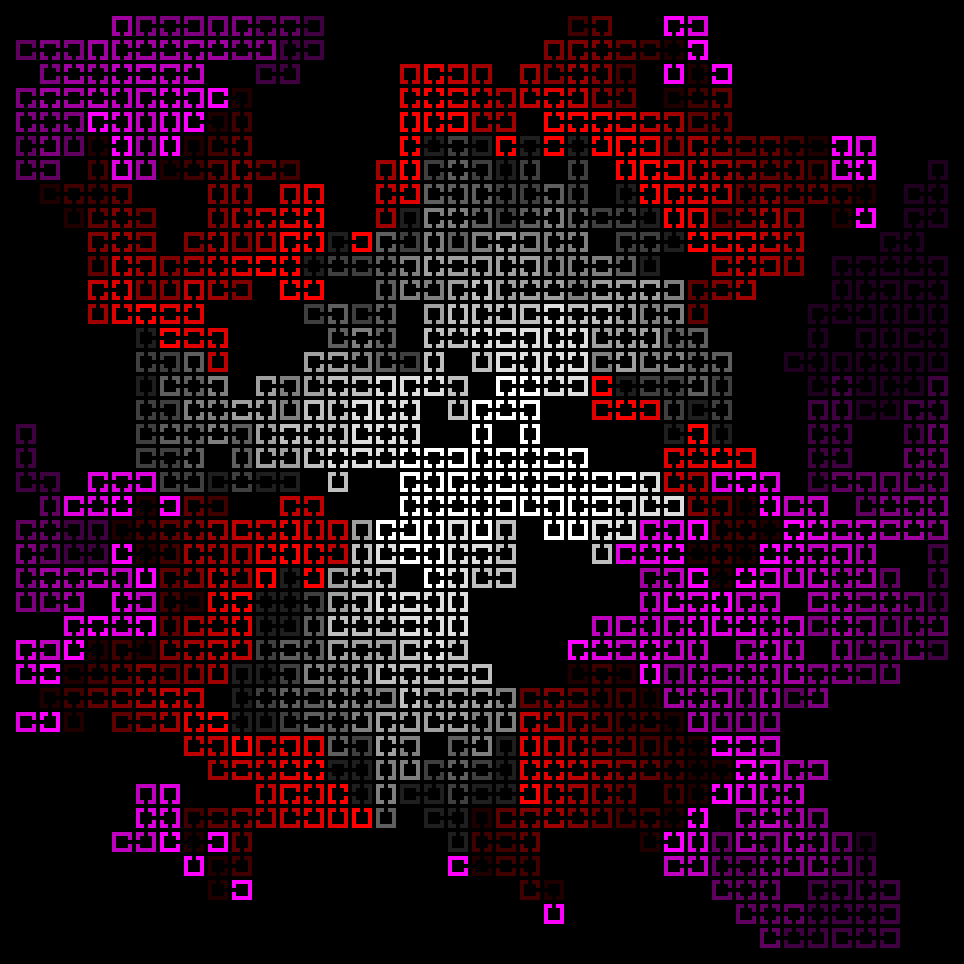 | 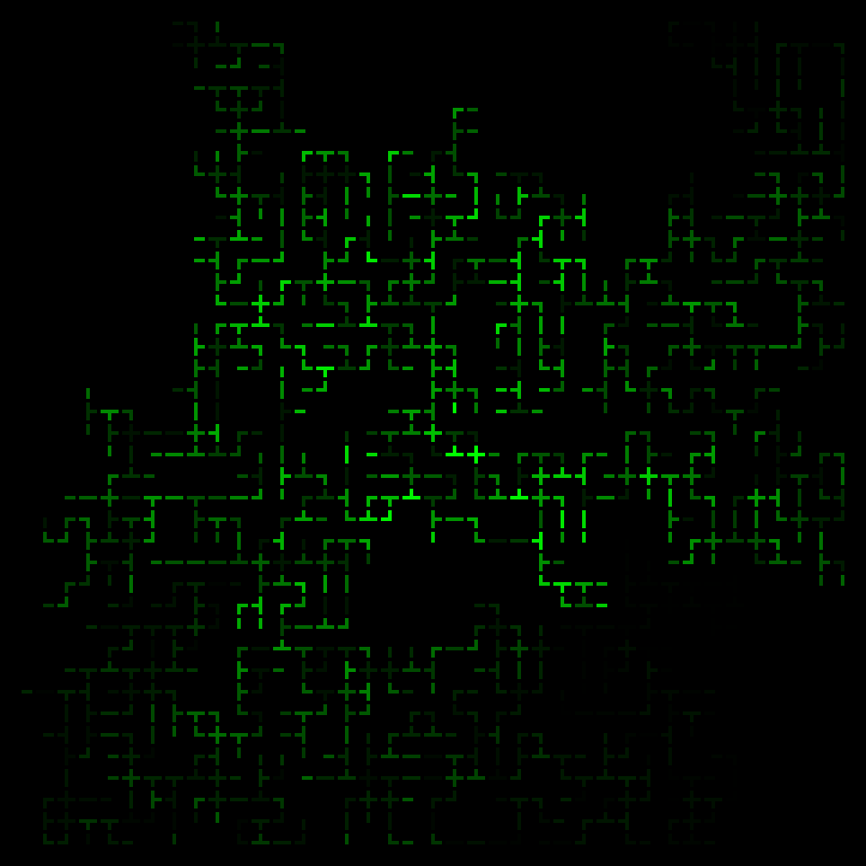 |
|-|-|-|

`worm.py`
| 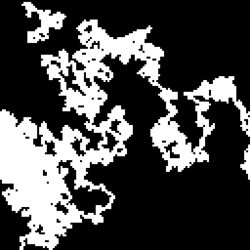 | 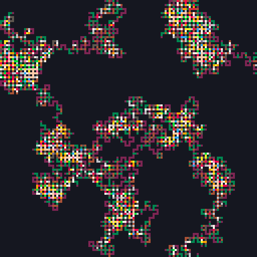 | 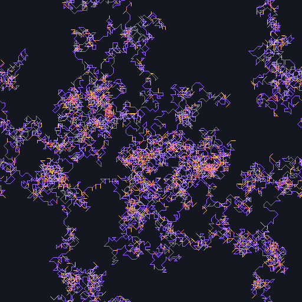 |
|-|-|-|

`puzzles.py`
<table width="100%">
  <tr>
    <td width="33.333%">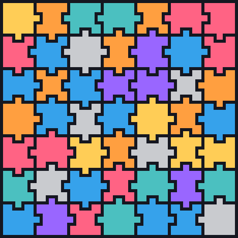</td>
    <td width="33.333%">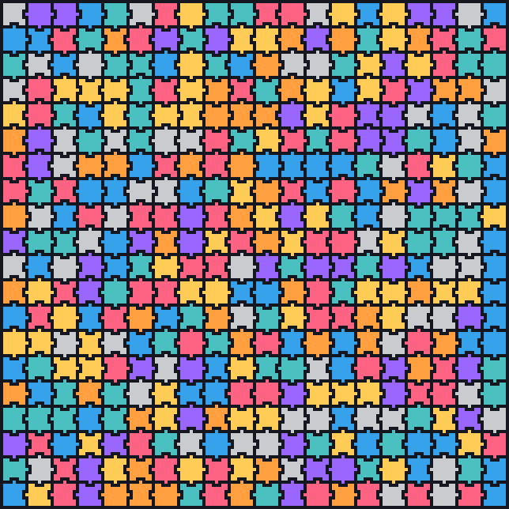</td>
    <td width="33.333%">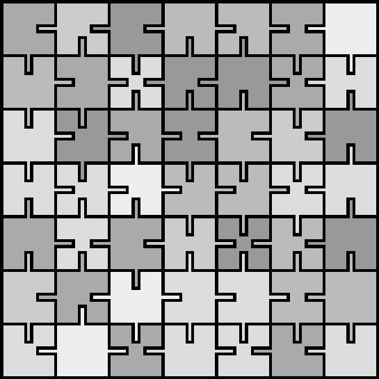</td>
  </tr>
</table>

`coprimes.py`
| 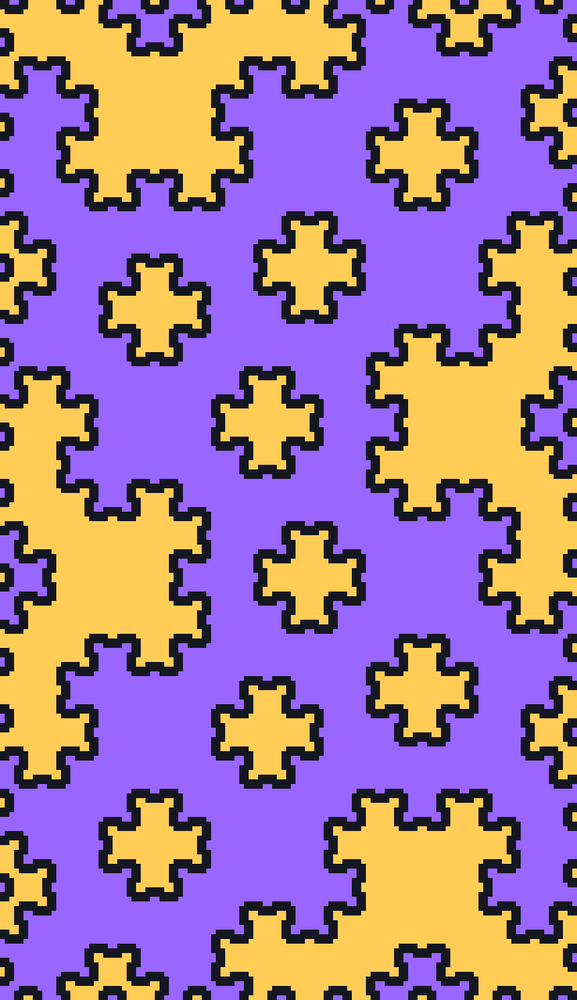 | 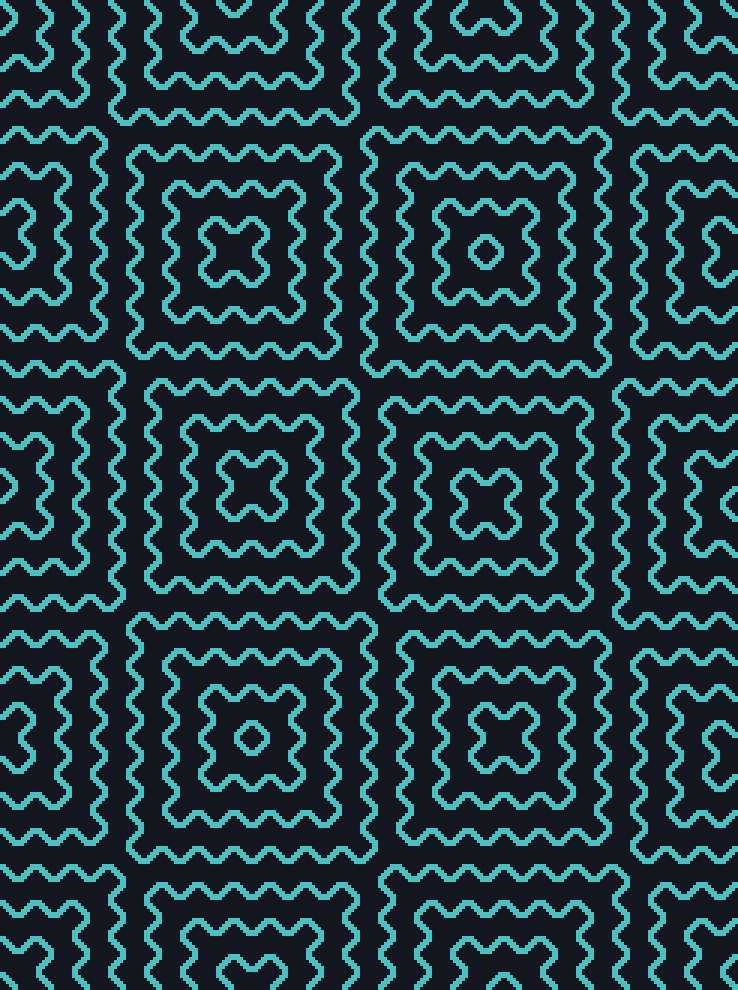 | 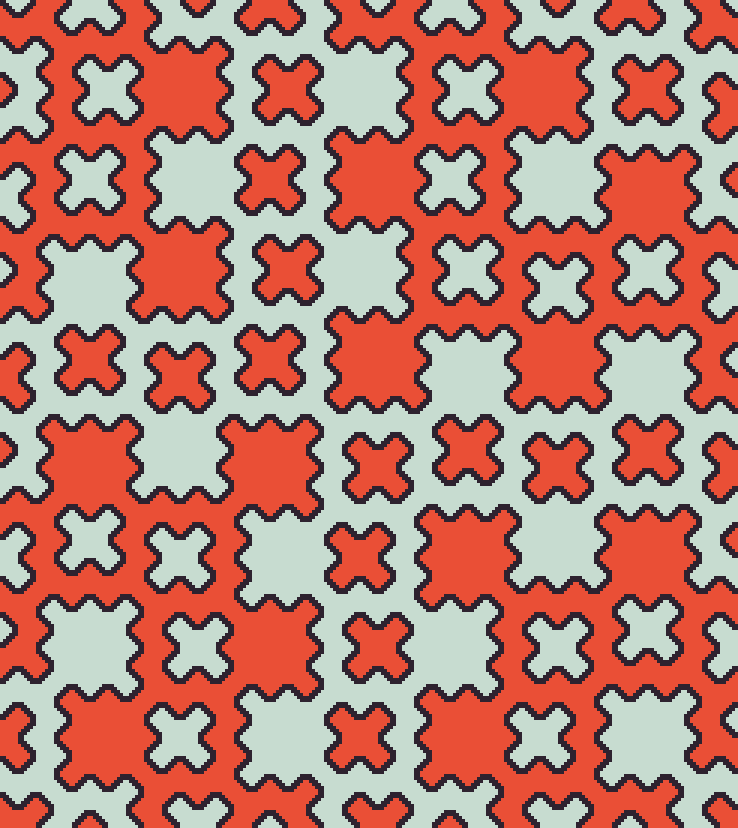 |
|-|-|-|
