#  Neiroart
A collection of scripts that generate images

## Installation
Scripts uses `PIL` and `numpy` to generate images.

```
pip3 install -r requirements.txt
```

## Settings
Almost every file contains different constants for customization, you can change these constants to get new generation variations. 

All constants available for modification are written in `CAPITALIZED` letters.

## Samples
Here some samples of generation.

`zombatars.py`
|  |  |  |
| - | - | - |

`enemies.py`
|  |  |  |
| - | - | - |

`glyphs.py`
| 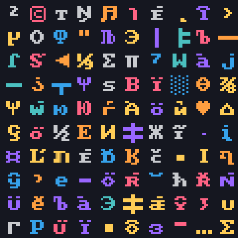 | 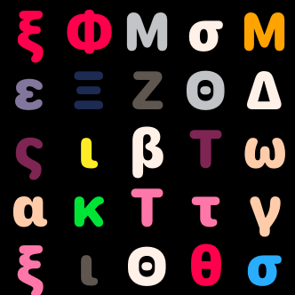 | 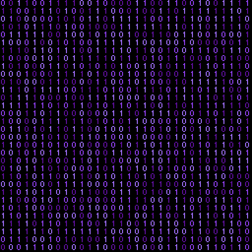 |
| - | - | - |

---

`map_simple.py`
| 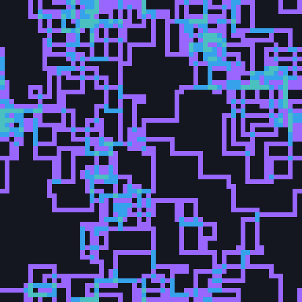 | 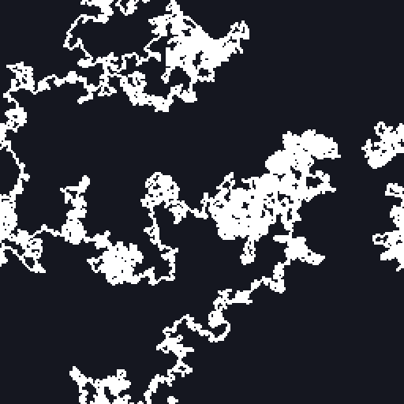 | 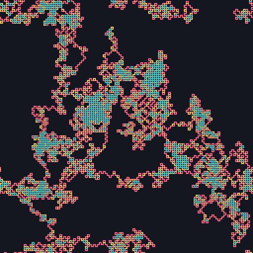 |
|-|-|-|

`map_linear.py`
| 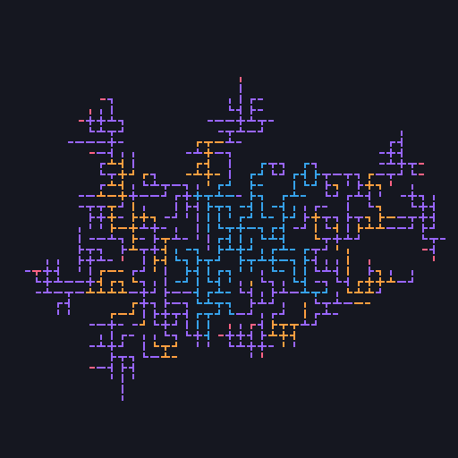 | 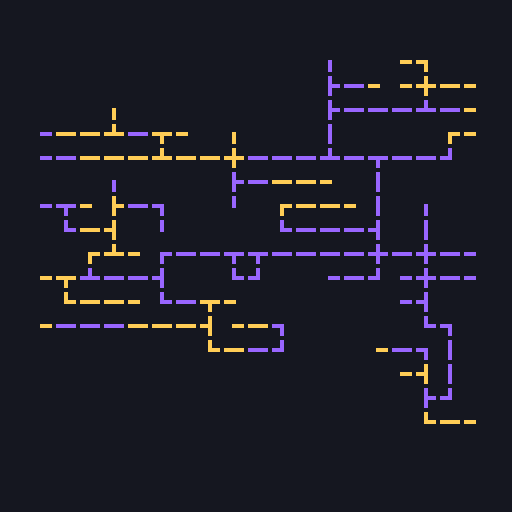 | 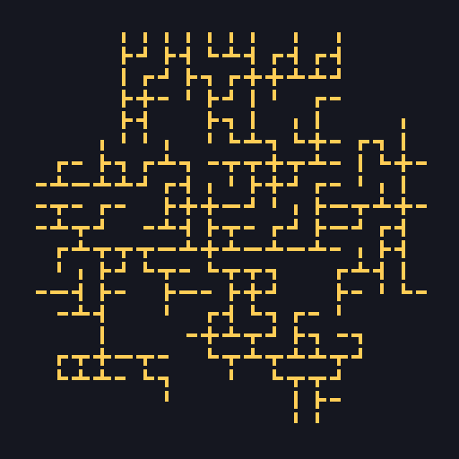 |
|-|-|-|

`map_squared.py`
| 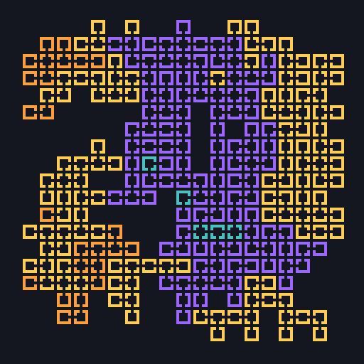 |  |  |
|-|-|-|

---
`primes.py`  
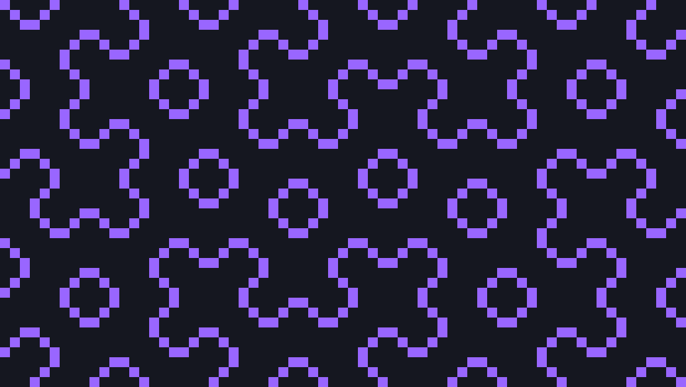  
  
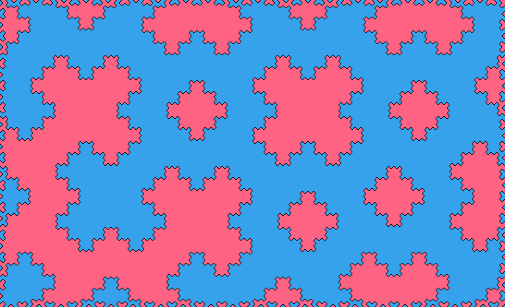  
