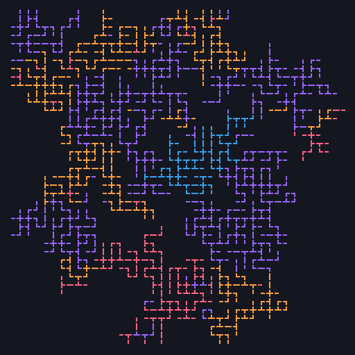
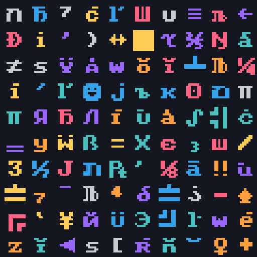
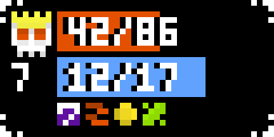
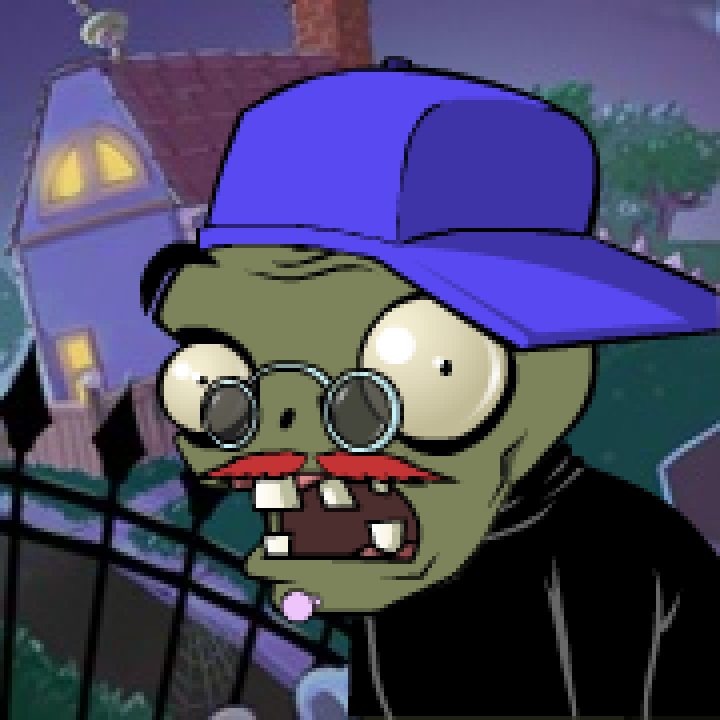

# Neiroart
Сборник скриптов для генерации изображений. 

## `map_simple.py`

## `map_linear.py`

## `map_squared.py`

## `glyphs.py`

## `enemies.py`

## `zombatar.py`

## Настройки
Почти во всех скриптах есть параметры 
* MAX_X = длина изображения
* MAX_Y = высота изображения
* MAX_ITERS = максимальное число итераций при генерации
* RESIZE_TO = кортеж для маштабирования по X и Y
