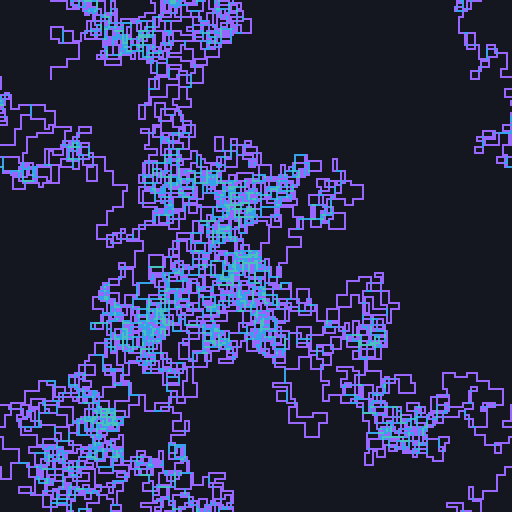
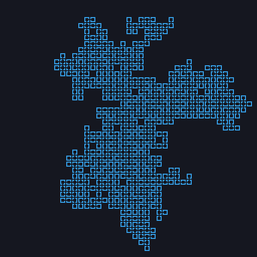

<table>
    <th><a href="./README.md">ENG</a></th>
    <th><a href="./README_ru.md">RUS</a></th>
</table>

<div align=center>
    
</div>

<h1 align=center>
    Neiroart
</h1>

<p align=center>
    Универсальный сборник скриптов для генерации изображений.
</p>

### Установка

Для работы скриптов понадобятся следующие python-пакеты:

- numpy
- Pillow

Для настройки среды установите модули в соответствии с `requirements.txt`:

```
$ pip3 install -r requirements.txt
```

### Настройки

Практически в каждом скрипте доступны параметры:

- `MAX_X` = длина изображения;
- `MAX_Y` = высота изображения;
- `MAX_ITERS` = максимальное количество итераций при генерации;
- `RESIZE_TO` = кортеж для маштабирования по X и Y.

## Процедурная генерация

#### `map_simple.py`



#### `map_linear.py`


#### `map_squared.py`



## Генерация из набора текстур и символов

#### `glyphs.py`


#### `enemies.py`


#### `zombatar.py`


